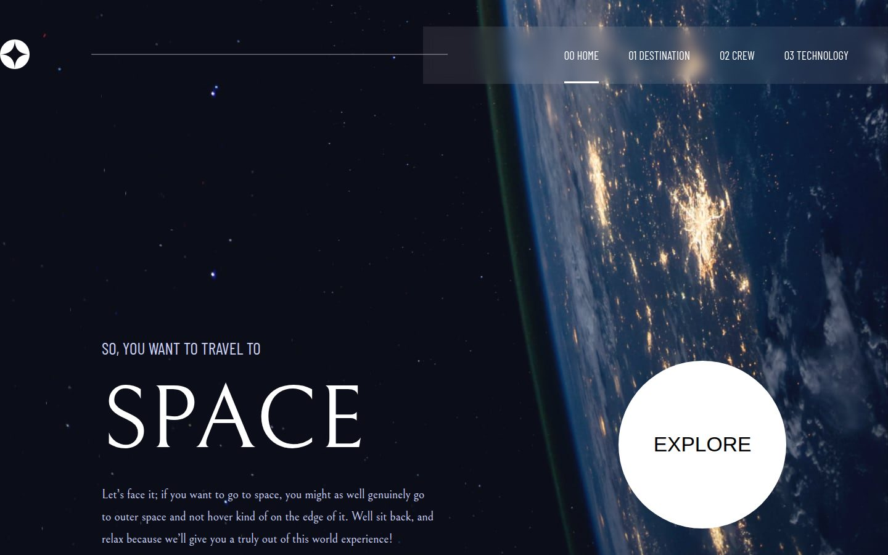
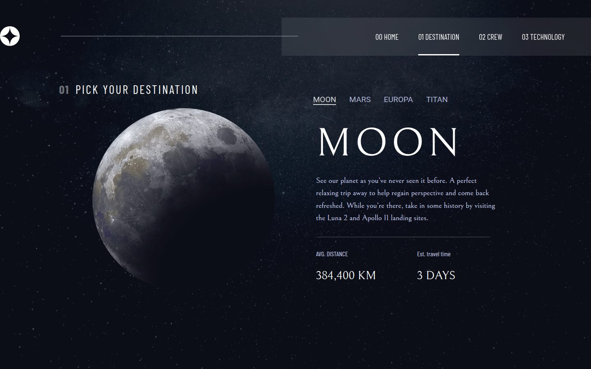
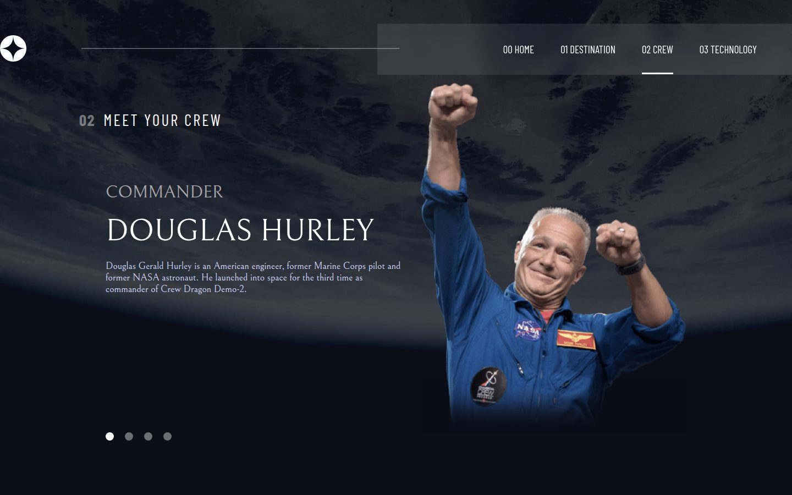
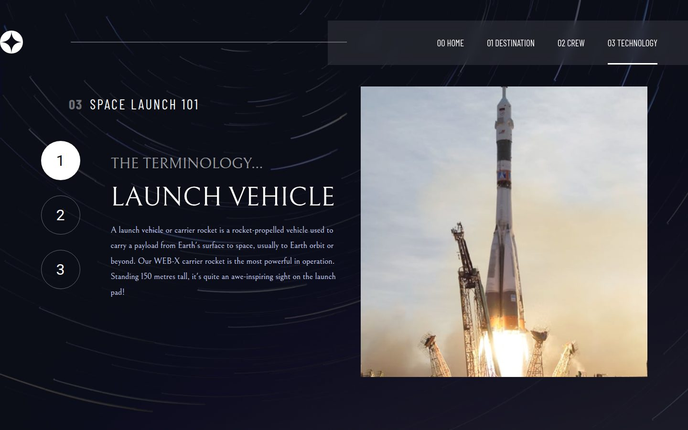
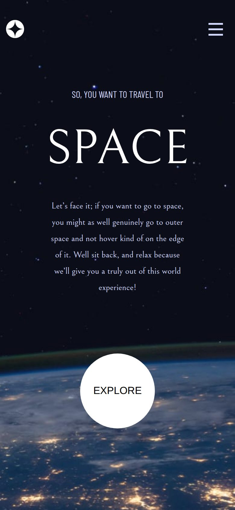

# Space Tourism — Multi-page Website

A multi-page website for a fictional space tourism company, built with React and React Router from a [Frontend Mentor](https://www.frontendmentor.io/challenges) design.

Live site: [space-toursim-davit.netlify.app](https://space-toursim-davit.netlify.app/home)



| Destination | Crew |
| --- | --- |
|  |  |

| Technology | Mobile |
| --- | --- |
|  |  |

## Features

- Four pages: Home, Destination, Crew, and Technology
- Nested routes: each destination (Moon, Mars, Europa, Titan), crew member, and technology has its own URL
- Tab, dot, and numbered navigation between items on each page
- Full-screen background images that change per page and per screen size
- Responsive layouts for desktop, tablet, and mobile, with a slide-out mobile menu

## Built with

- React 18 (Create React App)
- React Router 6 with nested routes and `NavLink` active states
- CSS with Flexbox and media queries

## Run locally

```bash
npm install
npm start        # http://localhost:3000
npm run build    # production build in build/
```

Deployed on Netlify; `netlify.toml` redirects all paths to `index.html` so deep links work.
